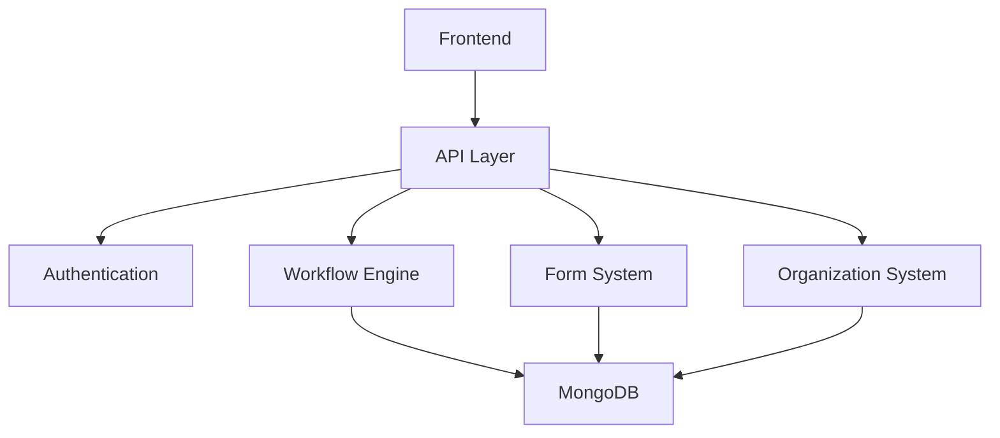

# BeeFlow Architecture

## System Overview

BeeFlow is designed as a modular workflow automation system with these key components:

### Core Components

1. **Workflow Engine**
   - Workflow definition management
   - Process execution
   - Task management
   - State management

2. **Form System**
   - Dynamic form definition
   - Form validation
   - Form rendering support

3. **Organization System**
   - User management
   - Department hierarchy
   - Role management
   - Permission system

### Technical Stack

- **Backend**
  - Node.js with TypeScript
  - Express.js framework
  - MongoDB for data storage
  - JWT for authentication

- **API Layer**
  - RESTful API design
  - OpenAPI/Swagger documentation
  - Standardized response format
  - Comprehensive error handling

## Design Decisions

### 1. MongoDB Choice
- Document-based structure matches workflow data
- Flexible schema for varying form data
- Good performance for read-heavy operations
- Native support for JSON data

### 2. TypeScript Implementation
- Strong type safety
- Better developer experience
- Enhanced code maintainability
- Improved IDE support

### 3. Modular Architecture
- Separation of concerns
- Independent service layers
- Pluggable components
- Easy to extend

## Data Flow

## Security Architecture

1. **Authentication**
   - JWT-based token system
   - Refresh token mechanism
   - Session management

2. **Authorization**
   - Role-based access control
   - Department-based permissions
   - Action-level restrictions

3. **Data Security**
   - Input validation
   - Request sanitization
   - Error handling

## Performance Considerations

1. **Caching Strategy**
   - Workflow definitions
   - User permissions
   - Form templates

2. **Database Optimization**
   - Indexed queries
   - Efficient data structures
   - Pagination support

3. **API Performance**
   - Response compression
   - Rate limiting
   - Bulk operations support 